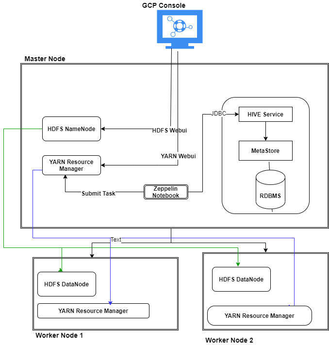

Table of contents

* [Introduction](#Introduction)
* [Hadoop Cluster](#HadoopCluster)
* [Hive Project](#HiveProject)
* [Improvements](#Improvements)

# Introduction

In this project,the Jarvis Data Analytics Team wants to move from SAP and R to Hadoop Ecosystem to process the big data using Apache  Hadoop.
We were tasked with analyzing and processing the World Development Indicators (WDI) dataset, which contains approximately 22 million data points.
Used Apache Hadoop, HDFS, YARN, Hive, Zeppelin to process World Development Indicators (WDI) and generate meaningful insights.
- Provisioned Hadoop Cluster on GCP (Google Cloud Platform).
- Solved business problems using Apache Hive and Zeppelin Notebook.

# Hadoop Cluster

## Big Data Tools

* HDFS: HDFS is Hadoop Distributed File System. It is distributed file system designed to hold a very large amount of data (terabytes or petabytes) and provide high-throughput access to this information. 
- Name Node: Namenode is where the metadata about the namespace of the files/directories are stored. It is in charge of the inserting, searching, and deleting of any file. Datanodes report to Namenode.
- Data Node: Datanode is the physical storage in which the data is stored across the cluster.
* YARN: YARN is a Hadoop resource managing architecture that manages resources and allocates resources to each application accordingly.
- ResourceManager: keeps track of live NodeManagers and available resources. Allocates available resources to appropriate applications and tasks. Monitors ApplicationMasters.
- NodeManager: Provides computational resources in form of containers. Manages processes running in containers.
* Hive: Apache Hive is a framework for data warehousing on top of Hadoop. It was created to make working with queries/analysis easier for SQL-strong analysts. It has many similar characteristics to RDBMS with some differences.
- Hive Client: Number of different mechanisms for connecting to Hive server from applications: Beeline(JDBC Driver), ODBC, Thrift
- Hive Services: Metastore, FileSystem, Execution Engine.
- Metastore: Hive metastore is the central repository of Hive metadata for the data warehouse.
* Apache Zeppelin: A web-based notebook that allows users to connect to Hive in a node, run data analysis, exploration, and visualization.

# Hive Project

Optimization of any Table leads to better performance of query in less time.  When working with lots of data, any minor optimization can have a large impact on query efficiency. To speed up our queries, I partitioned the data tables so that if we need to access data that is contained within one partition, we can use only that partition rather than loading all the data into memory.
Furthermore, I used a columnar file format which stores our data by having columns be adjacent to each other rather than rows. Queries that require us to get a value from each row in a table are much faster in a columnar file because they will be all found in one column. Had we not used a columnar file format, we would have to access each row in the table to get what we need.

# Improvements

- Spark Engine has better performance than Apache Tez so using Spark for each and every query will lead to reduction in overall time of execution for Notebook queries.

- More Worker nodes can be incorporated instead of only two nodes which can allow for greater parallelization and leads to faster execution times.

- Hive and Hadoop offer several other ways to make your queries faster, such as map-side joins and indexing