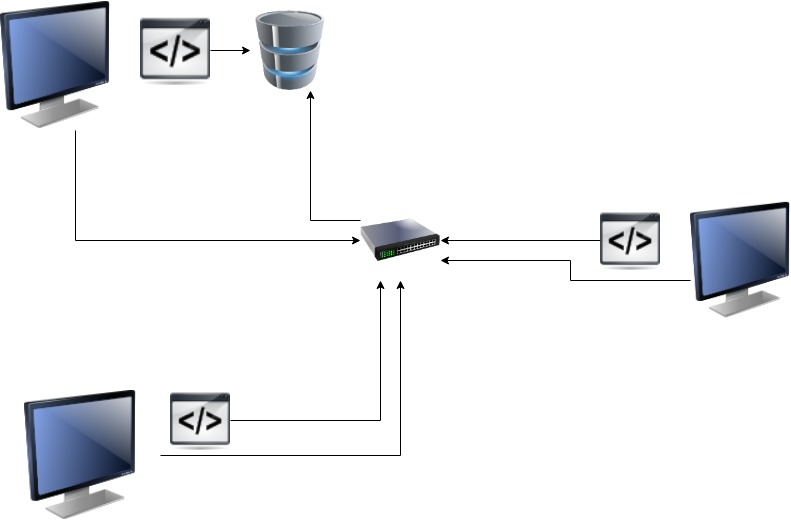

LINUX CLUSTER MANAGEMENT SYSTEM

LCMA is used to monitor and collect data of various host machines connected through a network. The data that is collected includes hardware specifications, activity, and performances of machines in the cluster
Data is stored in PostgreSQL Database which is an RDBMS database using Docker Containers.
Bash Scripts are used to initialize the process by creating psql container using Docker.
Bash scripts are also used to monitor the host usage and host information data. This system uses crontab to collect real-time data every minute to generate statistics regarding resource utilization.
The Monitoring agent sends the data to a database for storage and further analysis.

Technologies used : Docker,Git,Linux,PostgreSQL,Bash

# Quick Start
-Start a psql instance using psql_docker.sh

./scripts/psql_docker.sh create [db_username] [db_password]

-Create tables using ddl.sql
psql -h psql_host -U db_username -d host_agent -f ddl.sql

-Insert hardware specs data into the DB using host_info.sh
/scripts/host_info.sh [psql host] [port] host_agent [db_username] [db_password]

-Insert hardware usage data into the DB using host_usage.sh
./scripts/host_usage.sh psql_host psql_port host_agent db_username db_password

-Crontab setup

edit cronjobs
crontab -e
add to crontab

`````* * * * * bash <your path>/scripts/host_usage.sh localhost 5432 host_agent postgres password > /tmp/host_usage.log`````

# Implemenation
The psql_docker.sh script was implemented, and this created a PostgreSQL container which is useful.
Bash scripts are used to collect hardware specifications as well as resource usage.
database host_agent was then set up using PostegreSQL command line interface.
DDL.sql was implemented to create tables for the hostagent database.Host_info and host_usage are the two tables created using this script.
Queries.sql is created to retrieve the data from the table for analysis.
after that I created host_usage and host_info Bash scripts to help insert the data.host_usage was also used to setup crontab jobs.

## Architecture



## Scripts
Shell script description and usage

There are five scripts used in this project which are as follows:
1)psql_docker.sh : shell script that is used to create, start, or stop the PostgreSQL Docker container. A username and password must be passed if creating the container.

````bash scripts/psql_docker.sh create|start|stop [db_username] [db_password]````

2)host_info.sh : Shell script that will fetch the hardware specifications of the machine and insert it into the database. The hostname, port number, database name, database username, and database password must be passed.

````bash scripts/host_info.sh localhost 5432 hostagent postgres your_password````

3)host_usage.sh : Shell script that will fetch the resource usage of the machine and insert it into the database. The hostname, port number, database name, database username, and database password must be passed.

````bash scripts/host_usage.sh localhost 5432 hostagent postgres your_password````

4)ddl.sql: Create a SQL table that will be used to store information of host information and host usage.

````psql -h localhost -U postgres -W ddl.sql````

5)crontab: A special file that is used to periodically run a script over and over again.

## Database Modeling
The host_agent database contains two tables:
-host_info contains the hardware specifications of each node in the cluster.
| Field     |  Description |
| ------------- | ------------- |
|id |Primary Key, Auto-incremented unique identifier for the host |
|hostname|Unique name of the computer|
|cpu_number|Number of CPUs in the computer|
|cpu_architecture|Architecture of the computer|
|cpu_model|Model of the computer|
|cpu_mhz|The clock speed of the CPU, in MHz|
|L2_cache|The size of the L2 cache in kB|
|total_mem|The total memory in the node in kB|
|timestamp|The time when the hardware specifications were taken|

-host_usage which contains the usage specifications of each node in the cluster.
| Field        |   Description   |
| ------------- | ------------- |
|timestamp|Time when this information was recorded|
|host_id|The ID of the corresponding host|
|memory_free|The amount of free memory in the node in MB|
|cpu_idle|Percentage of CPU not being used|
|cpu_kernel|Percentage of CPU used by the kernel|
|disk_io|Number of disk reads and writes|
|disk_available|Amount of disk space available (in MB)|

# Test

-The monitoring agent was fully set up and tested on a CentOS 7 virtual machine. Testing was performed on a single server computer
Artificial data were inserted for testing purposes
-For the bash scripts, testing was done in the terminal using a command line to ensure everything was running properly.
-SQL queries were tested using PSQL command line and ensured the result is accurate.


# Improvements

While this is a perfect monitoring agent to monitor all the activities few improvements that could be made are :

-More variety of hardware usage data could be collected and stored which will give better wider hardware information of node usage.

-More Tables could be created to store wider information instead of storing all the usage information in one table.

-Periodically taking Backup of Database would help to preserve Data.

